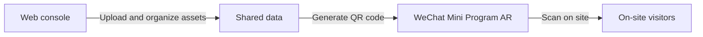

# User Guide

Welcome to the **Sanlin Old Street digital platform** — a platform for placing digital content (photos, text, sound, 3D models and more) at real-world locations. Once content is placed, visitors on site can see and hear it right where it belongs, through their phones.

This guide has two parts:

- **Part 1: The web console** — where teams organize members and map content in the browser.
- **Part 2: The WeChat Mini Program AR experience** — where visitors scan a QR code and experience the content on site through their phone camera.

---

## Overview

The two sides share the same data. Teams upload and organize assets in the web console, then generate a QR code; visitors scan it with WeChat and experience the content on site.



Content is organized by **organizations** and **workspaces**: an organization represents a team or project, and each organization can contain several workspaces, each with its own set of assets. You may belong to one or more organizations, depending on how your administrator has set things up.

---

# Part 1: The Web Console

## Signing Up and Logging In

### Sign up

The sign-up page supports two methods; **phone sign-up** is the default:

- **Phone**: enter your 11-digit phone number and a password (at least 8 characters), tap **Send code**, enter the 6-digit SMS code, then tap **Verify and sign up**. You are logged in automatically on success.
- **Email**: switch to the email tab, enter your email and password, then open the confirmation link sent to your inbox before logging in.

### Log in

On the login page, enter your **email or phone number** in the same input field, plus your password — the platform recognizes the account type automatically.

### Forgot password

Click **Forgot password?** on the login page, then enter your account:

- **Email**: you will receive a reset email; follow its link to set a new password.
- **Phone**: you will receive an SMS code; after verifying it you can set a new password directly.

## Home Page and Navigation

After logging in, the **Enter workspace** button on the home page takes you to the **Manage** page (the platform's main interface).

Other entries live in the **avatar menu at the top right**, shown according to your role:

- **Manage** — visible to all logged-in users.
- **On-site Upload** — visible to members and above.
- **Admin Console** — visible to organization administrators.

## Joining an Organization

You need to belong to an organization before you can see its content. The most common way to join is an **invite link**: an administrator sends you a link; open it, log in (or sign up first), and you are added to the organization automatically and taken to the Manage page — nothing else required.

If you cannot see an organization or workspace you should have access to, contact your administrator.

## The Manage Page

This is the platform's main interface, with three areas: **asset list (left)**, **3D map (center)**, and **detail panel (right)**.

Across the top, from left to right: the **organization switcher**, the **workspace switcher**, and the **QR code button**. The workspace dropdown also offers an "All workspaces" option that shows assets from every workspace in the organization at once.

### Asset list (left)

- Filter the list with three dropdowns at the top: **tags**, **creator**, and **type**. You can also switch between compact and detailed views, or refresh the list.
- Click any item to select it and view or edit its details on the right.
- Click an item's **Locate** button and the map camera flies to that asset's position.
- Click the **multi-select** icon to enter multi-select mode, where you can select all, clear the selection, or delete several assets at once.

### 3D map (center)

Every asset with a location appears as an icon on the map. The map and the list work together: click an icon on the map and the matching list item is highlighted; click an empty spot on the map to pick a location (its coordinates appear on the right), which is handy when uploading new content.

The toolbar on the left of the map offers three modes:

- **Pan** — normal browsing; drag to move the map.
- **Move asset** — drag an asset directly on the map to change its position.
- **Box select** — draw a rectangle to select every asset inside it; a bar then appears above the map where you can **copy** the selection (into the current workspace) or **delete** it.

Other view controls: drag with the **middle mouse button**, or hold **Ctrl** and drag with the left button, to rotate the view. The **Reset view** button at the top right restores the initial view, and the basemap button next to it switches the base map — **OpenStreetMap** is a safe choice if you are unsure.

### Detail panel (right)

- **Clicked location**: shows the coordinates of the point you clicked on the map.
- **Upload panel**: expand it to upload new assets directly (see *Asset Types* below). For photos, if the image file already carries the location where it was taken, you can use that; otherwise use the point you clicked on the map.
- **Asset editor**: with an asset selected, you can view and edit —
  - **Basic info**: name, description, and **tags** (search, create new tags, and change tag colors).
  - **Preview**: view images, play audio/video, and preview 3D models (drag to rotate, zoom for detail); images can be replaced by clicking or dragging in a new file.
  - **Location & anchor**: edit longitude/latitude/height, or **link the asset to an anchor** (linked assets are connected to their anchor with red lines on the map).
  - **Appearance**: 3D models have a **scale** setting and a "large model" switch; text assets have **text color** and **text size** settings (these affect how they appear in the Mini Program).
  - At the bottom are **Save**, **Cancel**, and **Delete** buttons; deletion asks for confirmation.

## On-site Upload

The **On-site Upload** page is designed for phones, for capturing content while you are physically at a location. It shows which workspace you are uploading to and your device's **GPS status** (allow the browser to access your location).

Three capture modes:

- **Photo** — take a photo with the camera or choose one from your album, with an optional title and description.
- **Text** — type a piece of text directly.
- **Audio** — start/stop a recording, listen back before uploading, and add an optional title and description.

Uploaded content is placed on the map at your current GPS position, and you can pick or create **tags** for it as you go. The upload button stays disabled until a location fix and a workspace are available.

## QR Codes: Connecting to the Mini Program

Once an organization is selected on pages like Manage or On-site Upload, a **QR code button** appears at the top right. Click it to open the "Scan to open the Mini Program" panel. The QR code always matches your currently selected organization and workspace — switch workspaces and the code changes with you.

Share or print this QR code, and visitors can scan it with **WeChat** to jump straight into the matching workspace's AR experience (see Part 2).

## Asset Types

Everything placed on the map is called an **asset**. At a glance:

| Type | Description | Size limit |
| --- | --- | --- |
| Anchor | A named point of interest used to group other assets | — |
| Text | A piece of written content | — |
| Image | A photo, automatically compressed for smooth loading | 10 MB |
| Audio | A sound clip: narration, ambience, music, etc. | 3 MB |
| Video | A short video clip | 3 MB |
| Link | A URL | — |
| Shop / check-in point | Shop info and a reward image for the Mini Program check-in game | 10 MB |
| Document | PDF, Word and similar files (must be enabled for the organization) | 20 MB |
| 3D model | A 3D model file (.glb / .gltf, must be enabled for the organization) | 3 MB |

A few notes:

- An **anchor** is like a pin on the map with a title and a note. Other assets can be linked to it, grouping everything at one place or theme together; the map shows the relationships with red lines. Anchors require a name and a manually chosen map location.
- A **shop / check-in point** powers the Mini Program's check-in game: fill in the shop's name and description and upload a reward image, which visitors receive as a keepsake after checking in on site.
- **Documents** and **3D models** are off by default; the organization owner must enable them in the admin console settings.

### About link assets (Luma AI)

Link assets work well for web content that can be embedded, such as 3D captures made with Luma AI. The Luma AI capture management page is here: [https://lumalabs.ai/dashboard/captures](https://lumalabs.ai/dashboard/captures).

A common workflow is to create the capture in Luma AI and copy the embed code it provides. If you copied a full iframe snippet, you do not need the whole snippet — only the URL inside `src="..."`:

```html
<iframe src="https://lumalabs.ai/embed/55b47e0e-3ed7-4d38-83ef-c34e8a08f7fe?..." width="500" height="500"></iframe>
```

So the actual value to upload is just:

```text
https://lumalabs.ai/embed/55b47e0e-3ed7-4d38-83ef-c34e8a08f7fe?...
```

## Roles

Each organization has four roles, from most to least powerful:

| Role | What they can do |
| --- | --- |
| Owner | Everything: organization settings, member management (including assigning owners), workspace management, uploading and editing assets |
| Admin | Member management (except owners), workspace management, uploading and editing assets |
| Member | Browse content, upload and edit assets, use On-site Upload |
| Viewer | Read-only: browse content, with upload and edit controls hidden |

If some buttons or pages are missing for you, it is usually a role restriction — contact your organization administrator.

## The Admin Console (for Administrators)

Owners and admins manage their organization in the **Admin Console**, which has three sections:

- **Members**:
  - **Add member** — search existing platform users by email or name, pick a role, and add them.
  - **Invite link** — generate a link to send out: choose the role granted on joining, optionally a workspace, and an expiry (1 day / 7 days / 30 days / never). The recipient opens the link, logs in, and joins automatically.
  - In the member list you can change roles inline, **assign workspaces** (controlling which workspaces each person can access), or remove members.
- **Workspaces**: create, edit, and delete workspaces (just a name and description).
- **Settings** (owners only): edit the organization's name and description, set the map center, choose the **allowed file types** (e.g. enable document and 3D model uploads), and configure how content appears in the Mini Program (text style, confetti effect, shop check-in, watermark logo). The delete-organization action at the bottom is irreversible — use with care.

## Personal Settings

Open **Settings** from the avatar menu to change your display name. The email or phone number you log in with cannot be changed.

---

# Part 2: The WeChat Mini Program AR Experience

The Mini Program is for on-site visitors: **no account, no login** — just scan a QR code with WeChat.

## Getting In

Scan the QR code generated in the web console (or displayed on site) with **WeChat's scanner**. The Mini Program opens directly onto the matching organization and workspace; the home screen shows their names. Tap **Start the journey** to enter the AR experience.

If you have scanned more than one QR code, a **switch organization / space** control appears on the home screen, letting you move between the places you have visited recently.

## Permissions

On first launch you will be asked for **location** and **camera** access — please allow both. They are used to find the content near you and to show the AR view; nothing works without them.

If you declined earlier by accident, a red banner appears on the home screen with an **Enable** button that takes you to the settings to turn them back on.

## The AR Experience

Once inside, the whole screen becomes the camera view. **Hold your phone up and look around slowly for a few seconds** — nearby content gradually appears around you:

- **Text** floats as chat bubbles in the air;
- **Images** stand like photos in space, always facing you;
- **Audio** appears as a headphone marker — the sound gets louder as you approach and fades as you move away; get close to one source and the others quiet down;
- **Videos** play on a loop;
- **3D models** stand where they were placed, and some large landmark models appear in the distance.

Content follows real locations, so **walking around is how you discover more** — the experience works best outdoors on foot. You can see content within roughly twenty meters at a time, and new items keep appearing as you move.

Two little extras:

- **Plant a tree**: tap the ground in the camera view to plant a tree right there — as many times as you like.
- **Send a message**: type into the input bar at the bottom and hit send. Your message flies into the AR world in front of you and stays at your location — later visitors to the same spot will see it too.

The small dot to the left of the input bar is the **GPS signal light**: green means positioning is working; red means no signal for the moment, in which case content cannot load and messages cannot be sent — move to an open area and wait a moment.

## Shop Check-in (enabled for some events)

If your event has the check-in game enabled, an extra check-in button appears at the bottom of the AR screen. Open it and:

- Swipe through nearby shop cards, each showing the shop's photo, description, and distance from you, with your progress at the top (e.g. "2/5 checked in").
- A compass arrow on screen points toward the selected shop — just follow it.
- Once you are within **50 meters** of the shop, the card's button becomes **Check in**; if you are too far, it shows "Too far".
- After a successful check-in, the shop's reward image pops up — tap **Save to album** to keep it (saving asks for album permission the first time).
- Your progress is saved automatically, so you can continue next time.

## Troubleshooting

- **Nothing appears**: make sure location and camera permissions are on, the GPS light is green, and you are actually near an area with content; look around slowly for a few seconds before walking.
- **No sound**: check your phone is not muted, and walk closer to the headphone marker.
- **No account needed**: web console accounts are only for managing content — visiting requires no login.

---

## Summary

The full workflow:

1. The team signs in to the **web console**, joins an organization, and places images, text, audio, video, links, anchors, or 3D models at real locations via **Manage** or **On-site Upload**.
2. In the console, open the **QR code button** and share or display the code on site.
3. Visitors scan it with **WeChat**, allow location and camera access, tap **Start the journey**, and explore the AR content as they walk — planting trees, sending messages, and joining the shop check-in game along the way.

If you have questions or need help, contact your organization administrator.
