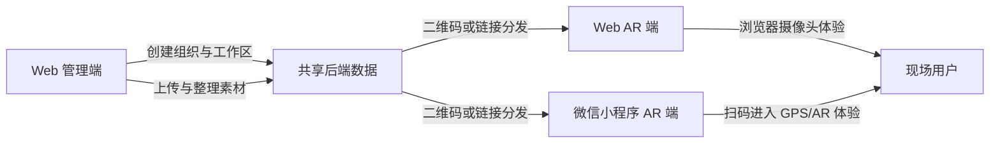

# 用户使用指南

欢迎使用 **AR Memory** —— 一个将数字内容与真实地点相结合的平台。本指南将帮助您全面了解平台的使用方法。

---

## 概览

AR Memory 让您可以把照片、文字、音频、视频、链接乃至三维模型"钉"在地图上的真实位置。拥有访问权限的人打开地图，找到该地点，就能看到、听到或体验那里的内容。

整个产品矩阵由三个彼此配合的端组成：**Web 管理端**用于整理组织、成员、工作区与地图内容；**Web AR 端**用于在浏览器中通过摄像头体验增强现实内容；**微信小程序 AR 端**用于在现场通过扫码快速进入 GPS/AR 体验。

这三个端并不是各自独立的数据系统，而是共享同一套**组织、工作区与素材数据**。通常的协作关系是：团队先在 Web 管理端创建组织和工作区、上传或整理素材，再通过二维码或链接把对应工作区分发给用户，最后由用户在 Web AR 或微信小程序 AR 端打开并体验这些内容。



平台以**工作区**为单位进行组织。工作区是团队或社群共同管理内容的共享空间，也是三个端之间衔接的核心单位。您可以属于一个或多个工作区，具体取决于所在组织的设置。

---

## 平台操作方法

### 登录

在浏览器中打开应用，使用邮箱和密码登录。登录后将进入**首页**。

### 页面导航

从首页可以进入三个主要功能区：

- **管理** — 在交互式地图上浏览、查看和编辑工作区内的所有内容。
- **现场上传** — 将新内容添加到地图，通常在您身处某个地点时使用。
- **AR 查看** — 通过设备摄像头以增强现实方式体验内容。

随时可以通过顶部导航栏在这三个功能区之间切换。

### 切换工作区

如果您属于多个工作区，可以使用顶部导航栏中的**工作区切换器**进行切换。每个工作区拥有各自独立的内容。

如果您看不到需要访问的工作区，请联系所在组织的管理员。

### 管理页面

管理页面是查看所有内容的主界面，分为三个区域：

1. **内容列表（左侧）** — 显示工作区内的所有条目。可通过搜索栏或标签进行筛选。点击任意条目可选中它，并在右侧查看详情。
2. **地图（中间）** — 交互式三维地图。所有带有位置的条目都会以图标形式显示在地图上。点击地图图标可在列表中高亮对应条目；点击列表条目上的**定位**按钮，地图镜头会自动飞到该条目所在位置。
3. **详情面板（右侧）** — 显示所选条目的名称、描述、预览及其他信息。具有编辑权限的用户可以在此进行修改。

管理页面中的列表和地图会互相联动：

- 在列表中点击某个条目的**定位**按钮，地图会自动移动到对应地点。
- 在地图上点击某个条目的图标，左侧列表会自动找到并高亮这个条目。
- 在地图空白处点击，可以手动选择一个位置，方便上传新内容时使用。

在浏览地图时，您还可以使用一些基础操作来调整视角和显示方式：使用**鼠标中键拖动**，或者按住 **Control** 再用**鼠标左键拖动**，可以旋转视角，从不同角度查看场景。地图右上角的 **Reset** 按钮可将视角快速恢复到初始状态；右上角的 **Map** 按钮可用于切换底图，如果您不确定该选哪一种，选择 **OpenStreetMap** 即可正常使用。

### 现场上传

向地图添加新内容的步骤：

1. 从首页进入**现场上传**。
2. 选择目标工作区。
3. 选择要添加的内容类型（详见下方"内容类型介绍"）。
4. 填写相关信息并确定位置 —— 可以让应用读取设备 GPS，也可以在地图上手动点选位置。
5. 点击**保存**，内容即发布到地图上。

上传**图片、音频和文字**时，您通常可以用两种方式确定位置：如果文件本身带有位置信息，可以直接使用文件中的位置信息；如果没有，或者您想自己决定位置，也可以在地图上手动选点。

上传时，系统会自动对素材进行压缩，以便更顺畅地保存和加载。这通常不会影响素材的基本显示效果和位置。

### 二维码进入

在**管理**或**现场上传**等页面中，如果您已经选中了组织，标题栏右侧会出现一个小小的二维码按钮。它位于页面顶部导航区域的最右边，方便您随时找到。

点击这个按钮后，会在按钮下方弹出当前内容对应的二维码。二维码会跟随您当前选择的工作区变化：如果您切换了工作区，再次打开时看到的就是新工作区对应的二维码。使用微信扫描后，可以更快捷地进入对应内容。

---

## 各种不同类型的内容介绍

放置在地图上的每一个内容条目称为**素材（Asset）**。AR Memory 支持多种类型的素材，分别适用于不同场景。

### 锚点（Anchor）

锚点是地图上的一个命名地点标记，可以附带简短描述。其他素材（图片、音频、文字等）可以与锚点关联，将同一地点的内容聚合在一起。

可以把锚点理解为地图上的一枚"图钉"，带有标题和备注。

锚点是一种专门用于整理其他素材的特殊类型。它本身会显示在地图上，和它关联的其他素材之间会以红线连接，方便您看出它们之间的关系。

上传锚点时，需要您在地图上手动指定位置。它特别适合用来整理同一地点、同一主题或同一路线下的多条内容。

### 文字（Text）

文字素材在某个位置展示一段文本内容，适合分享故事、历史背景、说明信息或任何适合阅读的内容。

### 图片（Image）

图片素材在地图上放置一张照片。点击可查看大图，还可以添加说明文字为图片提供背景信息。

### 音频（Audio）

音频素材在某个位置放置一段声音，可以是讲解录音、环境声、音乐或访谈。点击播放按钮即可收听。

### 链接（Link）

链接素材在某个位置放置一个网址。点击后会打开对应的网页，适合引导用户访问与该地点相关的外部网站、文章或在线资源。

链接上传适合放入可以嵌入展示的网页内容。例如，您可以把 Luma AI 生成的三维内容作为链接素材上传到平台。

如果您要进入 Luma AI 的内容管理页面，可以使用这个入口：[https://lumalabs.ai/dashboard/captures](https://lumalabs.ai/dashboard/captures)。

一种常见做法是：先在 Luma AI 中生成内容，然后复制它提供的嵌入代码。如果您拿到的是一整段 iframe 代码，不需要把整段代码都上传，只需要取出其中 `src="..."` 里的那个网址并上传即可。

例如，像下面这样的代码中，真正需要上传的是 `src` 后面的链接：

```html
<iframe src="https://lumalabs.ai/embed/55b47e0e-3ed7-4d38-83ef-c34e8a08f7fe?..." width="500" height="500"></iframe>
```

也就是说，您只需要上传这一段链接：

```text
https://lumalabs.ai/embed/55b47e0e-3ed7-4d38-83ef-c34e8a08f7fe?...
```

### 三维模型（3D Model）

三维模型素材在地图上放置一个立体对象，可以在地图上浏览，也可以通过将设备摄像头对准该位置以增强现实方式体验。适合展示实物、雕塑、建筑或任何需要立体呈现的内容。

在预览三维模型时，您通常可以拖动查看不同角度，并通过缩放更清楚地观察细节。部分模型如果本身带有动作，预览时还会自动播放。

---

## 总结

AR Memory 将数字内容与真实地点紧密相连。以下是完整使用流程的简要回顾：

1. **登录**并选择您的工作区。
2. 使用**现场上传**将图片、文字、音频、链接、锚点或三维模型添加到特定位置。
3. 打开**管理**页面，在交互式地图上浏览所有内容，通过标签筛选，查看或编辑详情。
4. 使用 **AR 查看**，通过设备摄像头体验三维模型和其他内容。

如有任何疑问或需要帮助，请联系所在组织的管理员。
