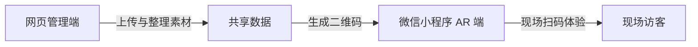

# 使用指南

欢迎使用**三林老街数字化平台**——一个把照片、文字、声音、三维模型等数字内容"放置"在真实地点上的平台。内容放置好之后，人们来到现场，用手机就能在原地看到、听到这些内容。

本指南分为两部分：

- **第一部分：网页管理端** —— 团队在浏览器中整理组织、成员和地图上的素材。
- **第二部分：微信小程序 AR 端** —— 访客在现场扫码，通过手机摄像头体验这些内容。

---

## 平台概览

两个端共享同一套数据。团队先在网页端上传和整理素材，再生成二维码；访客用微信扫码进入小程序，在现场体验。


```mermaid
flowchart LR
	A[网页管理端] -->|上传与整理素材| B[共享数据]
	B -->|生成二维码| C[微信小程序 AR 端]
	C -->|现场扫码体验| D[现场访客]
```

平台以**组织**和**工作区**来整理内容：一个组织对应一个团队或项目，组织内可以有多个工作区，每个工作区有各自独立的素材。你可能属于一个或多个组织，具体取决于管理员的设置。

---

# 第一部分：网页管理端

## 注册与登录

### 注册

注册页支持两种方式，默认是**手机注册**：

- **手机注册**：输入 11 位手机号和密码（至少 8 位），点击**发送验证码**，收到短信后输入 6 位验证码，点击**验证并注册**。成功后会自动登录。
- **邮箱注册**：切换到邮箱标签，输入邮箱和密码提交后，前往邮箱点击确认链接完成验证，再回到平台登录。

### 登录

在登录页的同一个输入框里输入**邮箱或手机号**，再输入密码即可，系统会自动识别账号类型。

### 忘记密码

在登录页点击**忘记密码？**，然后输入你的账号：

- 输入**邮箱**：会收到一封重置邮件，点击邮件里的链接设置新密码。
- 输入**手机号**：会收到短信验证码，验证通过后直接设置新密码。

## 首页与功能入口

登录后，首页的**进入工作台**按钮会带你进入**资源管理**页面（平台的主界面）。

其他功能入口在页面**右上角的头像菜单**里，按你的角色显示：

- **资源管理** —— 所有登录用户可见。
- **现场上传** —— 成员及以上角色可见。
- **管理后台** —— 组织管理员可见。

## 加入组织

你需要先属于某个组织才能看到它的内容。最常见的加入方式是**邀请链接**：管理员发给你一个链接，打开后登录（或先注册），系统会自动把你加入对应的组织并跳转到资源管理页面，无需其他操作。

如果你看不到应该看到的组织或工作区，请联系管理员。

## 资源管理页面

这是平台的主界面，分为三个区域：**资产列表（左侧）**、**三维地图（中间）**、**详情面板（右侧）**。

页面顶部从左到右依次是：**组织切换**、**工作区切换**和**二维码按钮**。工作区下拉中还有一个「所有工作空间」选项，选中后可以一次浏览组织内全部工作区的素材。

### 资产列表（左侧）

- 列表顶部可以用三个下拉菜单筛选：**标签**、**创建者**、**类型**，还可以切换紧凑/详细视图、刷新列表。
- 点击任意条目可选中它，并在右侧查看和编辑详情。
- 点击条目上的**定位到地图**按钮，地图镜头会自动飞到该素材所在位置。
- 点击**多选**图标进入多选模式，可以全选、取消全选，或一次删除多个素材。

### 三维地图（中间）

所有带位置的素材都会以图标显示在地图上。地图和列表是联动的：点地图上的图标，列表会自动高亮对应条目；点地图空白处，可以选中一个位置（右侧会显示坐标），方便上传新素材时使用。

地图左侧有三种操作模式：

- **平移** —— 普通浏览模式，拖动移动地图。
- **拖动素材** —— 直接在地图上拖动某个素材，改变它的位置。
- **框选** —— 在地图上拉一个框，一次选中框内的所有素材；随后地图上方会出现操作条，可以对选中的素材**复制**（复制到当前工作区）或**删除**。

其他视角操作：用**鼠标中键拖动**，或按住 **Ctrl** 再用左键拖动，可以旋转视角；右上角的**重置视角**按钮可以恢复初始视角；旁边的底图按钮可以更换地图底图，不确定选哪个时选 **OpenStreetMap** 即可。

### 详情面板（右侧）

- **点击位置**：显示你在地图上点选的坐标。
- **上传资源**：展开后可以直接上传新素材（详见下方「素材类型」）。上传图片时，如果照片本身带有拍摄位置，可以直接使用；否则用地图上点选的位置。
- **资源编辑器**：选中某个素材后，可以在这里查看和修改——
  - **基本信息**：名称、描述和**标签**（可以搜索、新建标签，还能给标签换颜色）。
  - **预览**：查看图片、播放音频/视频、预览三维模型（可拖动旋转、缩放查看）；图片可以点击或拖入新图替换。
  - **位置与锚点**：修改经纬度和高度，或把素材**关联到某个锚点**（关联后地图上会用红线连接）。
  - **外观样式**：三维模型可调**缩放倍率**和「大型模型」开关；文本可调**文字颜色**和**文字大小**（影响小程序端的显示效果）。
  - 底部有**保存**、**取消**和**删除**按钮，删除前会再次确认。

## 现场上传

**现场上传**页面为手机使用设计，适合你人在现场时随手采集内容。页面会显示当前要上传到哪个工作区，以及设备的**定位状态**（请允许浏览器获取位置）。

三种采集方式：

- **拍照上传** —— 调用相机拍照，或从相册选择，可填写标题和描述。
- **文本上传** —— 直接输入一段文字。
- **录音上传** —— 点击开始/停止录音，可以先试听再上传，也可填写标题和描述。

上传的内容会以你当前的 GPS 位置放置到地图上，还可以顺手为它选择或新建**标签**。如果定位未就绪或未选择工作区，上传按钮会暂时不可用。

## 二维码：连接小程序

在资源管理、现场上传等页面选中组织后，顶部右侧会出现一个**二维码按钮**。点击后弹出「扫码进入小程序」面板，二维码始终对应你当前选中的组织和工作区——切换工作区后再打开，二维码也会随之变化。

把这个二维码分享或打印出来，访客用**微信扫一扫**即可直接进入对应工作区的小程序 AR 体验（见第二部分）。

## 素材类型

放在地图上的每一条内容称为**素材**。各类型一览：

| 类型 | 说明 | 大小上限 |
| --- | --- | --- |
| 锚点 | 地图上的命名地点标记，用于聚合其他素材 | — |
| 文本 | 一段文字 | — |
| 图片 | 一张照片，会自动压缩以便加载 | 10 MB |
| 音频 | 一段声音：讲解、环境声、音乐等 | 3 MB |
| 视频 | 一段短视频 | 3 MB |
| 链接 | 一个网址 | — |
| 店铺 / 打卡点 | 店铺信息与打卡奖励图，用于小程序端打卡活动 | 10 MB |
| 文档 | PDF、Word 等文件（需组织开启后才可用） | 20 MB |
| 3D 模型 | 立体模型文件（.glb / .gltf，需组织开启后才可用） | 3 MB |

几点说明：

- **锚点**像地图上的一枚"图钉"，带标题和备注。其他素材可以关联到锚点上，把同一地点、同一主题的内容聚合在一起，地图上会用红线显示它们的关系。上传锚点时必须在地图上指定位置并填写名称。
- **店铺 / 打卡点**用于小程序端的打卡活动：填写店铺名称、介绍，并上传一张"打卡凭证"图片，访客在现场打卡成功后会获得这张图片作为纪念。
- **文档**和 **3D 模型**默认不开放，需要组织拥有者在管理后台的设置中勾选开启。

### 关于链接素材（Luma AI）

链接素材适合放入可以嵌入展示的网页内容，例如 Luma AI 生成的三维内容。Luma AI 的内容管理页面在这里：[https://lumalabs.ai/dashboard/captures](https://lumalabs.ai/dashboard/captures)。

常见做法是：在 Luma AI 中生成内容后复制它提供的嵌入代码。如果你拿到的是一整段 iframe 代码，不需要上传整段代码，只需取出其中 `src="..."` 里的网址：

```html
<iframe src="https://lumalabs.ai/embed/55b47e0e-3ed7-4d38-83ef-c34e8a08f7fe?..." width="500" height="500"></iframe>
```

也就是说，你只需要上传这一段链接：

```text
https://lumalabs.ai/embed/55b47e0e-3ed7-4d38-83ef-c34e8a08f7fe?...
```

## 角色说明

组织内有四种角色，权限从高到低：

| 角色 | 能做什么 |
| --- | --- |
| 拥有者 | 全部权限：组织设置、成员管理（含指派拥有者）、工作区管理、上传和编辑素材 |
| 管理员 | 成员管理（不能变更拥有者）、工作区管理、上传和编辑素材 |
| 成员 | 浏览内容、上传和编辑素材、使用现场上传 |
| 访客 | 只读：只能浏览，看不到上传和编辑入口 |

如果你发现某些按钮或页面看不到，通常是角色权限的原因，请联系组织管理员。

## 管理后台（面向管理员）

拥有者和管理员可以在**管理后台**中管理组织，左侧有三个栏目：

- **成员**：
  - **添加成员** —— 按邮箱或姓名搜索平台上已有的用户，选择角色后加入。
  - **邀请链接** —— 生成一个链接发给对方：可以指定加入后的角色、要加入的工作区，以及链接有效期（1 天 / 7 天 / 30 天 / 永不过期）。对方打开链接登录后自动加入。
  - 在成员列表中可以直接修改角色、**分配工作空间**（控制每个人能访问哪些工作区）或移除成员。
- **工作空间**：创建、编辑、删除工作区（填写名称和描述即可）。
- **设置**（仅拥有者可见）：修改组织名称和描述、设置地图中心点、勾选**允许的文件类型**（如开放文档和 3D 模型上传）、配置小程序端的显示效果（文本样式、彩带效果、店铺打卡、水印 Logo 等）。页面底部的删除组织操作不可撤销，请谨慎使用。

## 个人设置

在头像菜单进入**个人设置**，可以修改自己的显示名称。登录用的邮箱或手机号不可修改。

---

# 第二部分：微信小程序 AR 端

小程序是给现场访客使用的：**无需注册、无需登录**，用微信扫码即可进入。

## 进入小程序

用**微信扫一扫**扫描管理端生成的二维码（或现场展示的二维码），小程序会直接打开对应组织和工作区的内容。首页会显示当前组织和工作区的名称，点击**开启旅程**即可进入 AR 体验。

如果你扫过多个二维码，首页会出现**切换组织 / 空间**入口，可以在最近去过的几个地点内容之间切换。

## 授权提示

首次进入会请求**位置**和**相机**权限，请选择允许——它们分别用于找到你附近的内容和显示 AR 画面，缺一不可。

如果之前不小心拒绝过，首页会出现红色提示条，点击**去开启**即可前往设置重新打开。

## AR 体验

进入 AR 后，整个屏幕就是相机画面。**举起手机、缓慢环视几秒**，附近的内容会逐渐出现在你的周围：

- **文字**以聊天气泡的形式漂浮在空中；
- **图片**像立在空中的照片，始终面向你；
- **音频**显示为一个耳机标志，走近时声音变大，远离时变小；当你贴近某一个声源时，其他声音会自动安静下来；
- **视频**自动循环播放；
- **三维模型**立在它被放置的位置，一些大型地标模型会出现在远处的方向上。

内容跟随真实位置分布，**边走边看才能发现更多**——建议在户外步行体验，你一次能看到大约二十米范围内的内容，走动后会不断刷新出新内容。

两个小玩法：

- **种树**：点一下屏幕中的地面，就会在那里种下一棵树，可以反复种。
- **发弹幕**：底部输入框写下想说的话（提示语是"发个弹幕到 AR 世界~"），点发送后它会飞进你眼前的 AR 世界，并留在你所在的位置——之后来到这里的人也能看到你的留言。

输入框左侧的小圆点是 **GPS 信号灯**：绿色表示定位正常；红色表示暂时没有信号，此时看不到内容也发不出弹幕，可以走到开阔的地方稍等片刻。

## 店铺打卡（部分活动开启）

如果你参加的活动开启了打卡玩法，AR 页面底部会多出一个打卡按钮。点开后：

- 左右滑动浏览附近的店铺卡片，每张卡片显示店铺照片、介绍和与你的距离，顶部显示打卡进度（如「2/5 已打卡」）。
- 屏幕上会出现一个指南针箭头，指向你选中的店铺，跟着箭头走即可。
- 走到店铺 **50 米以内**，卡片上的按钮会变为**打卡**；距离太远时按钮显示「太远了」。
- 打卡成功后会弹出这家店铺的奖励图片，可以点**保存到相册**留念（首次保存需要允许相册权限）。
- 打卡进度会自动保留，下次进入可以接着完成。

## 遇到问题？

- **看不到任何内容**：确认位置和相机权限已开启、GPS 信号灯是绿色，并且你确实在有内容的区域附近；进入后先原地环视几秒再走动。
- **声音听不到**：检查手机没有静音，并走近耳机标志。
- **小程序不需要账号**：网页端的账号只用于管理内容，现场体验无需登录。

---

## 总结

完整的使用流程：

1. 团队在**网页管理端**注册登录，加入组织，在**资源管理**或**现场上传**中把图片、文字、音频、视频、链接、锚点或三维模型放到地图上的真实位置。
2. 在管理端点开**二维码按钮**，把二维码分享或展示在现场。
3. 访客用**微信扫码**进入小程序，允许位置和相机权限，点击**开启旅程**，在现场边走边体验 AR 内容，还可以种树、发弹幕、参加店铺打卡。

如有任何疑问或需要帮助，请联系所在组织的管理员。
